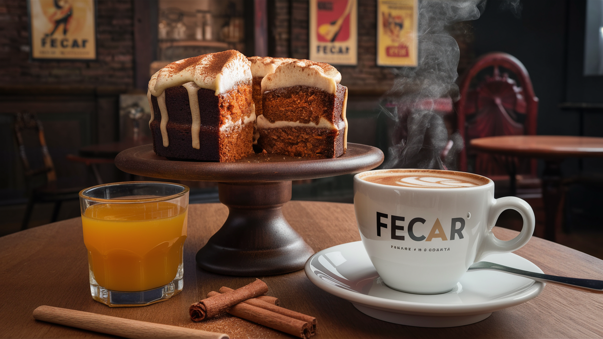

# FECAR Tienda de Café - Proyecto de Página Web
Práctica HTML-CSS para curso en TodoCode.

    

## Descripción

Este proyecto consiste en la creación de una página web para un café de especialidad argentino llamado **FECAR**. Se han realizado modificaciones en HTML y CSS para presentar información relevante sobre el café, sus servicios, menú y contacto.

## Secciones Modificadas

- **Encabezado:** Se ha ajustado el menú de navegación para incluir secciones como "Inicio", "Menú", "Nuestra Historia" y "Contacto".
  
- **Inicio:** Se ha creado una breve descripción del café y se ha agregado una imagen destacada.
  
- **Menú:** Se ha modificado la sección para incluir un menú breve de 10 opciones de platos dulces, salados y elaborados. Además, se ha agregado una imagen relacionada con el menú al final de la sección.
  
- **Nuestra Historia:** Se ha agregado una breve historia sobre el café de especialidad FECAR, resaltando su trayectoria desde 1998 y su enfoque en la calidad y las tradiciones argentinas.
  
- **Contacto:** Se ha incluido un formulario de contacto para que los visitantes puedan enviar mensajes. También se ha agregado información de contacto, como dirección, teléfono y redes sociales.
  
- **Servicios:** Se ha creado una sección sobre los servicios ofrecidos por el café, incluyendo entrega a domicilio, granos de café orgánicos, café de primera calidad y reservas en línea.

## Otros Cambios

- Se han realizado ajustes menores en el formato y estilo de las secciones para mejorar la coherencia y la presentación de la página.

Para más detalles sobre los cambios realizados, consulta los archivos HTML y CSS en el repositorio.

